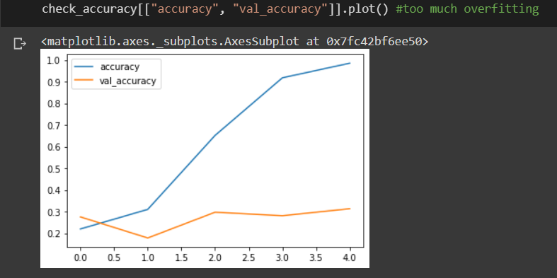
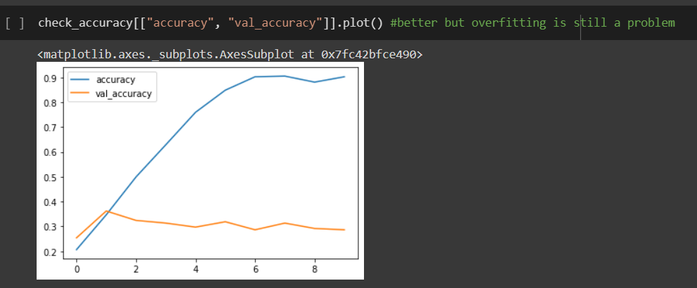
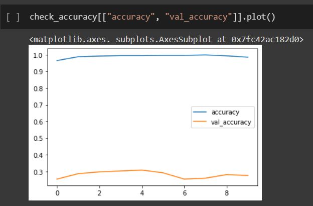
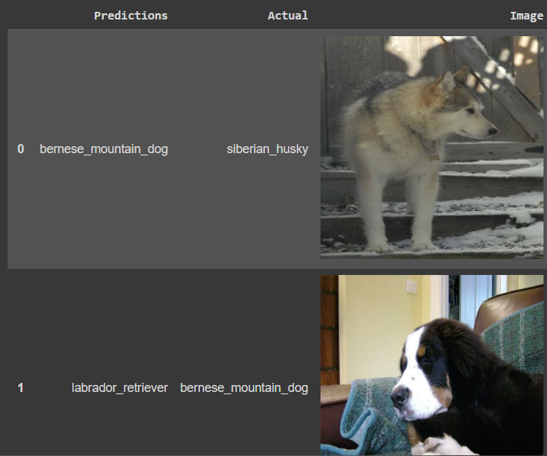
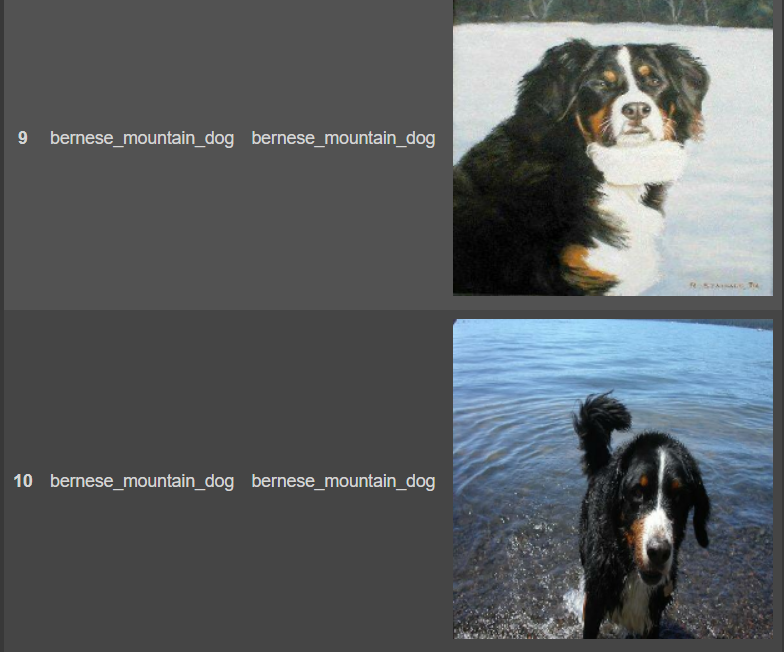
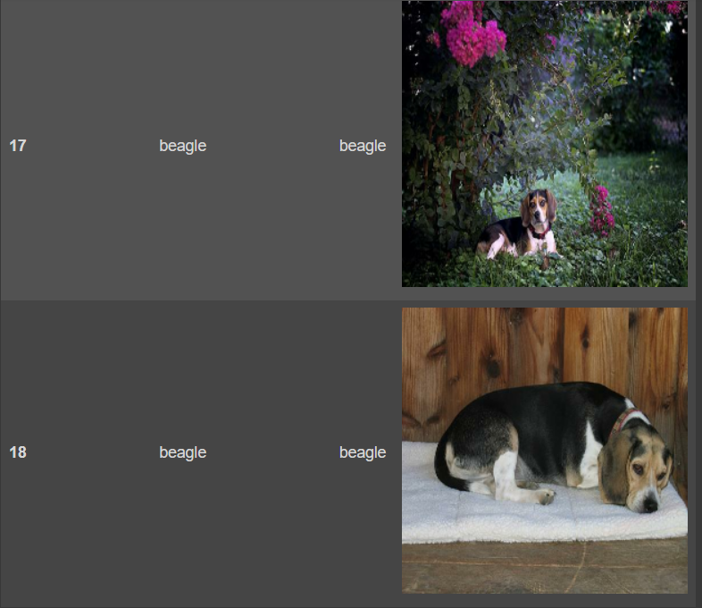

# Image Classification

A simple computer vision application that uses deep learning to classify images. You can train on any dataset of images as long as you have them available. In the case of this project, I had images of five dog breeds from Stanford. The model was trained with this dataset. To optimize the training and avoid overfitting, three convolutional layers were used with maxpooling after each, a categorical cross entropy loss function was used to deal with loss, and a dropout layer. As an additional step, data augmentation was also added into the network to further fight the overfitting. It was not the best image classifier, but it does a decent job. I plan to work on more projects of this nature to better the accuracy.

This application was created in the programming language python.

# References
Dataquest

